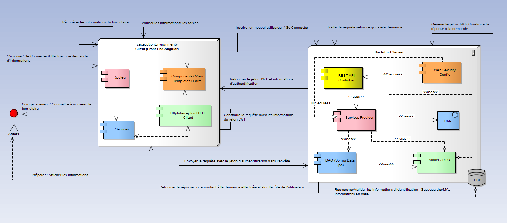
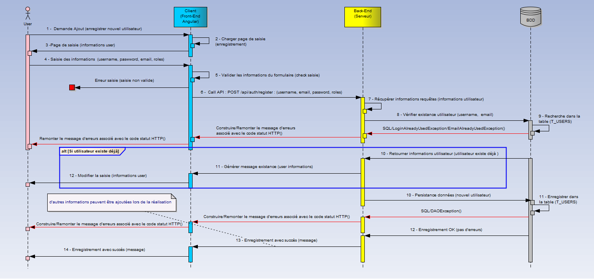
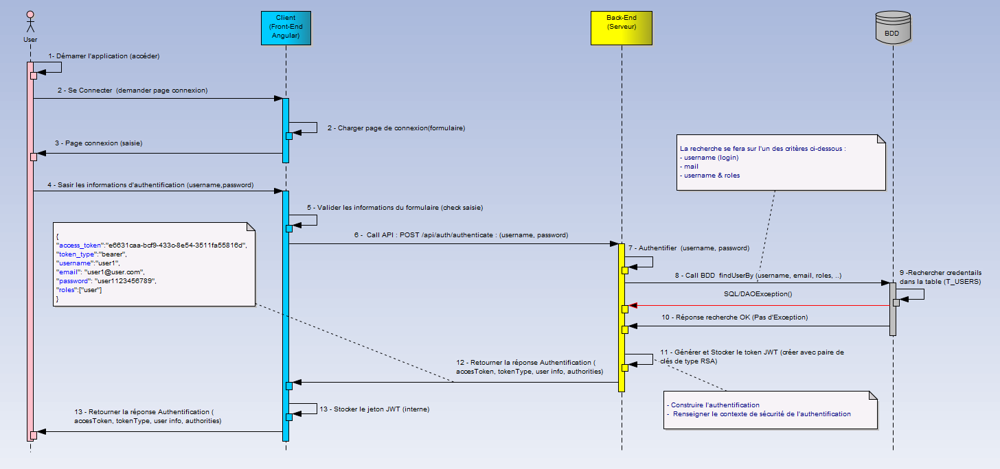
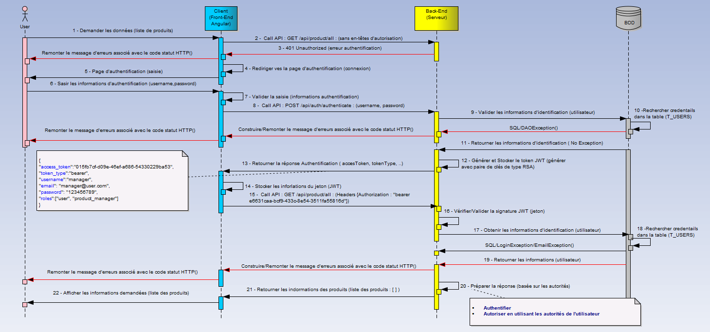
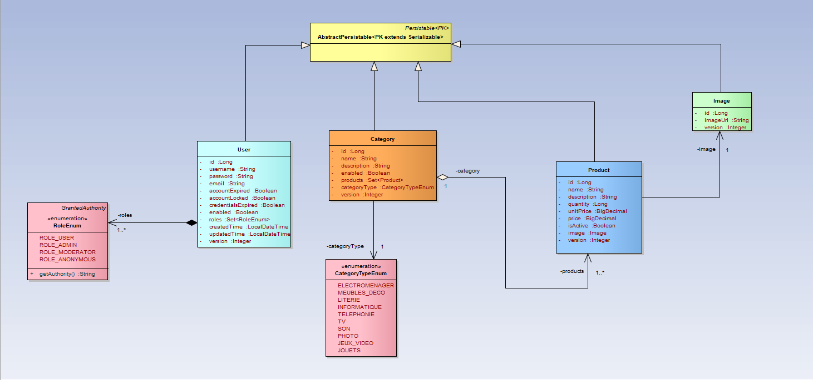

# Products Management Secure Web REST API    

`My Products` est une application Web sécurisée de gestion de produits avec leur catégorie (`service Web RESTFul Sécurisé`) écrit en **Java** et embarque **Spring** avec d'autres technologies non seulement pour l'intégration des différents composants applicatifs
mais également la sécurisation des ressources de l'application.  Il fournit principalement :
- un **Back-End Java** , embarquant :
	- _les exigences fonctionnelles ou métier_, 
	- _les exigences non fonctionnelles_. 
- un **Front-End Angular** (Client Web ) fournissant les interfaces utilisateurs pour pour interagir avec le Back-End par le biais d'interfaces utilisateur.

**NB** :
- les données/informations sont stockées dans une base de données relationnelles
- Voir la section `Les Exigences` pour plus de détails sur les fonctionnalités embarquées.
- Voir la section `Stack Technique` pour plus de détails sur l'ensemble des technos utilisées dans cette application.
- **SI** : Système d'informations.	

	
# Spécifications 
Dans cette section, quelques éléments sont fournis pour faciliter la compréhension du besoin et des réalisations techniques à venir.
Les élements des processus de gestion : des autorisation, authentication et sécurisation des ressources (de l'application), seront mis en place à partir des spécifications
**JWT** avec **Spring Security**. Les échanges se feront principalement entre le client (front-end) et le serveur (back-end). 
Les éléments ci-dessous sont fournis dans le cadre cette spécification :
- une brève présentation de JWT 
- le diagramme d'architecture applicative et technique
- les diagrammes de séquences du fonctionnement global pour les points suivants :
	- Ajouter un nouvel utilisateur avec ses rôles dans le SI.
	- Gérer la production/fourniture du jeton d'accès à la suite de la connexion des utilisateurs à l'application.	
	- Accès aux resources protégées : fournir le jeton d'accès dans l'en-tête de la requête lors de la demande d'informations.
- les schéma et modèle de données pour la gestion des informations **métier** de l'application.

## Brève Présentation JWT  
**JWT** (**J**SON **W**eb **T**oken), est une spécification pour la représentation des revendications (claims) à transférer entre deux parties. Les revendications sont codées en tant qu'objet JSON utilisé comme charge
 utile d'une structure chiffrée, permettant aux revendications d'être signées ou chiffrées numériquement. La structure peut être :
- **J**SON **W**eb **S**ignature (JWS) ou 
- **J**SON **W**eb **E**ncryption (JWE).

**NB** :
JWT peut être choisi comme format pour les jetons d'accès et d'actualisation utilisés dans le protocole OAuth2.

## Les Exigences 

### Les exigences fonctionnelles 
Le tableau ci-dessous dresse l'ensemble (une liste non exhaustive) des exigences fonctionnelles qui seront embarquées par le SI.
|Processus|Fonctionnalités|
|---|---|
|**Gestion des utilisateurs**|_<ul><li>Se Connecter/Déconnecter de l'application</li><li>Ajouter de nouveaux utilisateurs dans le SI avec leurs rôles</li><li>Mettre à jour les informations d'un utilisateur existant</li><li>Supprimer les informations de l'utilisateur du SI</li><li>Rechercher les informations d'un utilisateur dans le SI selon son identifiant</li><li>Obtenir la liste des utilisateurs du système</li></ul>_| 
|**Gestion des produits et leur catégorie**|_<ul><li>Ajouter de nouveaux produits avec leur catégorie dans le SI</li><li>Mettre à jour les informations d'un produit existant avec sa catégorie</li><li>Supprimer les informations d'un produit du SI</li><li>Supprimer les informations d'une catégorie de produit du SI</li><li>Rechercher les informations d'un produit dans le SI selon son identifiant avec la catégorie associée</li><li>Obtenir la liste des produits du système avec leur catégorie</li></ul>_|
|**Gestion de la Sécuriité**|_<ul><li>Gérer l'Authentification : qui permet de confirmer ou valider l'identité du client/l’utilisateur qui tente d’accéder au système d'informations</li><li>Gérer l'Autorisation (protection des ressources) : permet d’octroyer au client/l’utilisateur l’accès au système d’informations, donc aux ressources</li></ul>_|

### Les exigences non fonctionnelles 
Le tableau ci-dessous dresse une liste non exhaustive des exigences non fonctionnelles de l'application.
|Type Exigence|Fonctionnalités|
|---|---|
|**Exigences non fonctionnelles**|_<ul><li>Gérer les logs</li><li>Gérer les erreurs/exceptions</li><li>Gérer les accès à la base de données</li><li>Gérer la migration des scripts de base de données (création de schémas, insertion, mise à jour de tables ou de données ...) avec **Flyway**</li></ul>_|

### Le Client (Front-end)
A la lumière de tout ce qui est présenté ci-dessus, l'interface utilisateur doit permettre : 
	- Se Connecter à l'application/ Se Déconnecter de l'application.
	- Ajouter/Inscrire un nouvel utilisateur dans le SI.
	- Visualiser les informations des utilisateurs. 
	- Modifier les informations d'un utilisateur.
	- Supprimer les informations d'un utilisateur.

## Architecture Applicative et Technique Globale 
Le diagramme ci-dessous fournit une vision globale des flux d'échanges entre l'application et les acteurs du système et(ou) briques/composants applicatifs.
Elle comporte les éléments suivants :
- le **Back-End** qui embarque :
	- _Le serveur d'autorisation_ : intégrant le processus de validation des informations d'identification de l'utilisateur, production des jetons (jeton d'accès + jeton d'actualisation).
	- _Le Serveur de ressources_ : intégrant les points de terminaison de l'API REST à sécuriser et les éléments de gestion associés.
	- _Les différentes configurations_ de sécurisation des élements applicatifs.
- le **Front-End** : interface utlisateur avec les différents composants permettant d'effectuer/faciliter les échanges avec le back-end Java.
- le **SGBD** : pour le stockage et la persistance des informations métiers de l'application.

## Le Fonctionnement Global pour ajouter un nouvel utilisateur dans le SI
Le principe de fonctionnement de l'enrgistrement des informations d'un nouvel utilisateur dans le SI, est présenté par le diagramme de séquences ci-dessous :

## Le Fonctionnement Global pour se Connecter/Déconnecter de l'application
Le principe de fonctionnement de la connexion d'un utilisateur du SI avec ses informations, est présenté par le diagramme de séquences ci-dessous :

## Le Fonctionnement Global des accès aux ressources de l'application
Une vue macroscopique du fonctionnement global de l'application pour l'accès à ses ressources est fournie par le diagramme de séquences ci-dessous. Il est composé de deux principales phases:
- La demande et obtention des jetons d'accès après s'être authentifié
- L'accès proprement dit aux ressources de l'application avec le jeton d'accès.

## Modèles et Schémas de données
Les modèles fournis sont relatifs au *_*métier_**. Le diagramme de classes ci-dessous présente les relations entre les entités de gestion de la partie métier de l'application.

# Stack Technique
Une liste non exhaustive des technos embarquées pour le développment de cette application :
TODO

# Les Tests
Les outils de tests classiques de Java Spring sont utilisés pour effectuer des tests.

## Les Types de Tests
- _Tests unitaires_
- _Tests d'intégration_
- _Tests fonctionnels_

## Les Outils de Tests
Les outils de tests proposés ou utilisées sont les suivants :
- Outils de Tests de Spring Framework (spring-boot-starter-test) qui intègre:
	- spring-test, spring-boot-test, spring-boot-test-autoconfigure
	- JUnit 4+
	- Mockito
	- Assertions avec Assert-J,…
- Plugin JaCoCo maven (avec les plugin surefire et failsafe) pour produire le rapport de couverture de code.
- Postman pour tester l'API

## Rapport de couverture des tests
La couverture des tests est mesurée et fournie par JaCoCo. L'image ci-dessous fournit la couverture du code de l'application à l'exception des objets de couche de modèle.
TODO