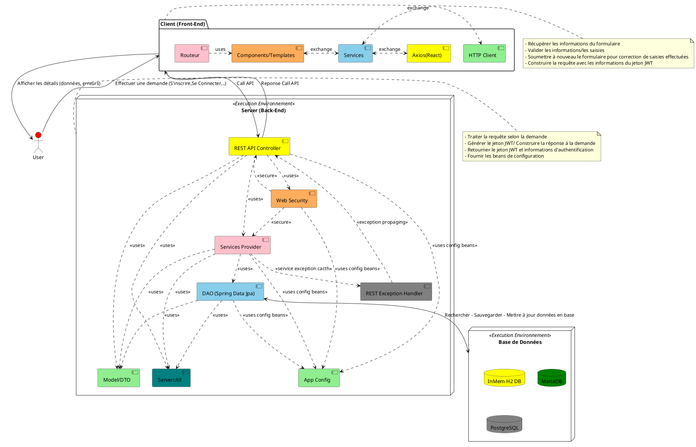
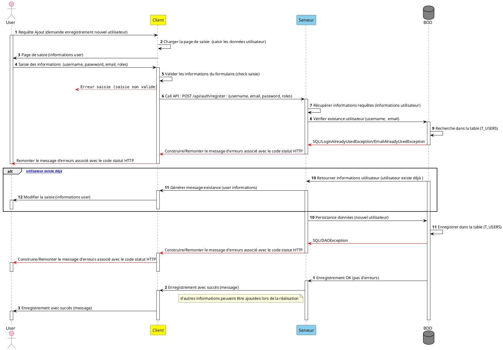
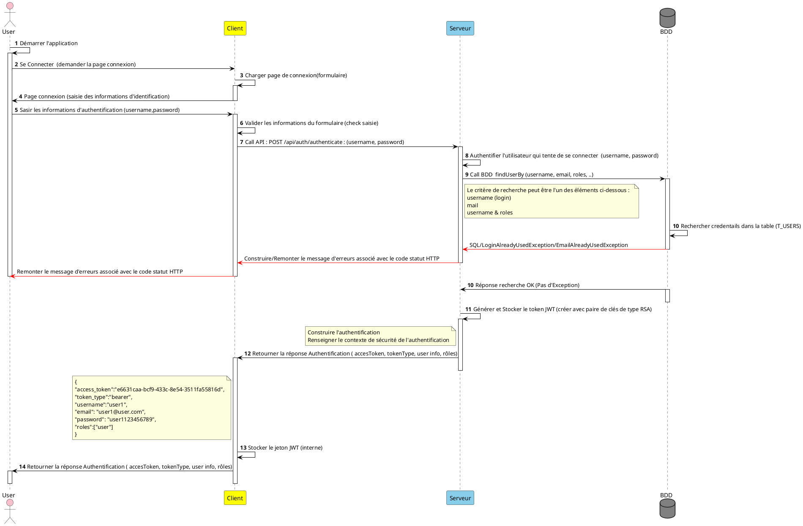
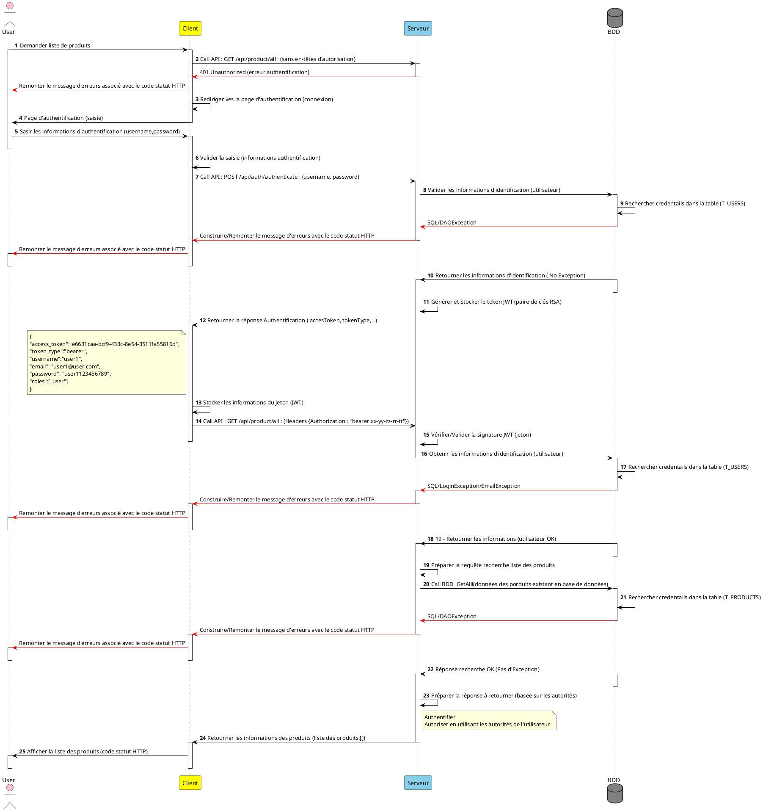
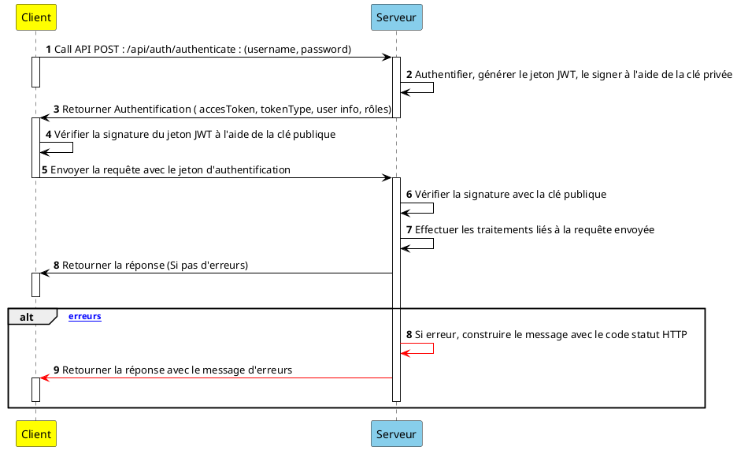
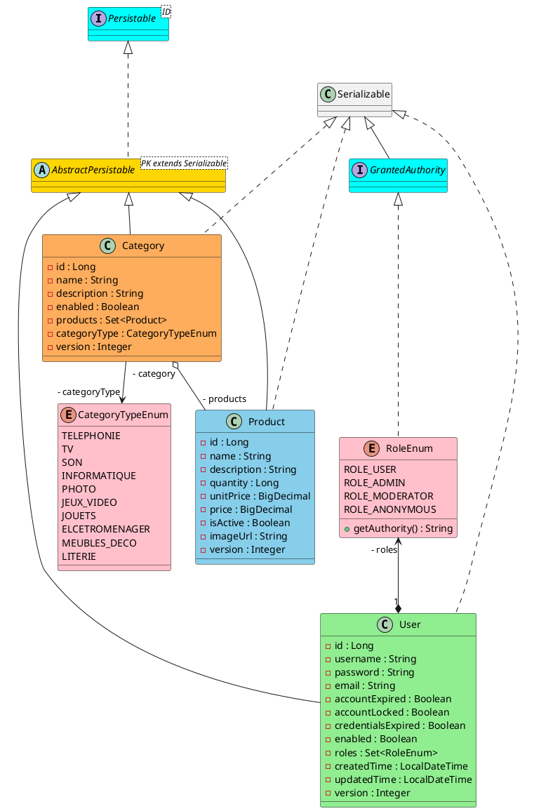

# Secure Web REST API (Products Management)    


 

# A Propos
**`My Products`** est une application Web sécurisée de gestion de produits avec leur catégorie (**`service Web RESTFul Sécurisé`**) écrit en **Java** et embarque **Spring** 
avec d'autres technologies pour :
- non seulement faciliter l'intégration des différents composants applicatifs (traduire en lignes de codes l'expression des besoins : `gérer les produits`, `gérer les catégories de produits`, ...), 
- mais également assurer la gesion de la `sécurité applicative` (sécuriser le SI donc les ressources et les échanges).

Il comporte principalement deux modules :
- un **Back-End Java** , basée sur une architecture **`REST`** et embarquant :
	- _les exigences fonctionnelles ou métier_, 
	- _les exigences non fonctionnelles_. 
- un **Front-End** (`Client Web` avec **`Angular JS`** ou **`React JS`**) fournissant les interfaces utilisateur pour consommer les fonctionnalités exposées par le Back-End Java (le serveur).

**NB** :
- _Les données/informations sont stockées dans une base de données relationnelles_.
- Voir la section **`Exigences`** pour plus de détails sur les fonctionnalités embarquées.
- Voir la section **`Stack Technique`** pour plus de détails sur l'ensemble des technos utilisées pour le développement de l'application.
- **SI** : **S**ystème d'**I**nformations.	

	
# Spécifications 
Dans cette section, quelques éléments sont fournis pour faciliter la compréhension du besoin et les réalisations techniques à venir.
Les élements des processus de gestion : **`autorisation, authentication et sécurité applicative`**, seront mis en place à partir des spécifications
**JWT** et **Spring Security**. 
Les échanges se feront principalement entre le client (`front-end`) et le serveur (`back-end Java`). Les éléments ci-dessous sont fournis dans le cadre cette spécification :
- Une brève présentation de **`JWT`** 
- Le diagramme d'architecture applicative et technique
- Les diagrammes de séquences du fonctionnement global de quelques cas d'utilisation :
	- _Ajouter un nouvel utilisateur avec ses rôles dans le système d'information_,
	- _Gérer la production/fourniture de jetons d'accès lorsque les utilisateurs se connectent à l'application_,	
	- _Accès aux resources (protégées) de l'application : fournir le jeton d'accès dans l'en-tête de la requête lors de la demande d'informations_.
- Les schéma et modèle de données pour la gestion des informations **métier** de l'application.


## Brève Présentation JWT  
**`JWT`** (**J**SON **W**eb **T**oken), est une spécification pour la représentation des revendications (_claims_) à transférer entre deux parties. Les revendications sont codées en tant qu'objet `JSON` utilisé comme charge
 utile d'une structure chiffrée, permettant aux revendications d'être signées ou chiffrées numériquement. La structure peut être :
- **J**SON **W**eb **S**ignature (`JWS`) ou 
- **J**SON **W**eb **E**ncryption (`JWE`).

Les **`JWT`** contiennent les informations nécéssaires pour aider au stockage de la **`session utilisateur`**, etc. **`JWT`** peut être aussi choisi comme format pour les jetons d'accès et d'actualisation
utilisés dans le protocole **`OAuth2`**.

## Les Exigences 

### Les exigences fonctionnelles 
Le tableau ci-dessous fournit une liste non exhaustive des exigences fonctionnelles qui seront embarquées par le SI.
|Processus|Fonctionnalités|
|---|---|
|**Gestion des utilisateurs**|_<ul><li>Se Connecter/Déconnecter de l'application</li><li>Ajouter de nouveaux utilisateurs dans le SI avec leurs rôles</li><li>Mettre à jour les informations d'un utilisateur existant</li><li>Supprimer les informations de l'utilisateur du SI</li><li>Rechercher les informations d'un utilisateur dans le SI selon son identifiant</li><li>Obtenir la liste des utilisateurs du système</li></ul>_| 
|**Gestion des produits**|_<ul><li>Ajouter les informations de nouveaux produits dans le SI</li><li>Mettre à jour les informations d'un produit existant dans le SI</li><li>Supprimer les informations d'un produit du SI</li><li>Rechercher les informations d'un produit dans le SI selon son identifiant</li><li>Obtenir la liste des produits du système</li><li>Obtenir la liste filtrée de produits dont le nom `match` avec le `pattern` fourni</li></ul>_|
|**Gestion des catégories de produits**|_<ul><li>Ajouter de nouvelles catégories de produits dans le SI</li><li>Mettre à jour les informations d'une catégorie de produits dans le SI</li><li>Supprimer les informations d'une catégorie de produits du SI</li><li>Rechercher les informations d'une catégorie de produits dans le SI</li><li>Obtenir la liste des catégories de produits du SI</li><li>Obtenir la liste filtrée de catégories de produits dont le nom de produit `match` avec le `pattern` fourni</li></ul>_|
|**Gestion de la Sécurité dans l'application**|_<ul><li>`Authentification` : permet de confirmer ou valider l'identité du client/l’utilisateur qui tente d’accéder au système d'informations</li><li>`Autorisation` (protection des ressources) : permet d’octroyer au client/l’utilisateur l’accès au système d’informations, donc aux ressources de l'application</li></ul>_|

### Les exigences non fonctionnelles 
Les exigences non fonctionnelles sont plutôt d'ordre technique, mais elles participent à l'implémentation des besoins exprimés et au bon focntionnement de l'application. 
Le tableau ci-dessous dresse une liste non exhaustive des exigences non fonctionnelles de l'application.
|Type Exigence|Fonctionnalités|
|---|---|
|**Exigences non fonctionnelles**|_<ul><li>Gérer les logs</li><li>Gérer les erreurs/exceptions</li><li>Gérer les accès à la base de données</li><li>Gérer la migration des scripts de base de données (création de schémas, insertion, mise à jour de tables ou de données ...) avec **`Flyway`**</li></ul>_|

### Le Client (Front-end)
L'interface utilisateur permet selon ses rôles définis dans l'application (les droits de l'utilisateurs) :
- **`Gestion des utilisateurs`** :
	- _Se Connecter/Déconnecter de l'application_,
	- _Ajouter/Inscrire un nouvel utilisateur dans le SI_,
	- _Visualiser les informations des utilisateurs_, 
	- _Modifier les informations d'un utilisateur_,
	- Supprimer les informations d'un utilisateur.
- **`Gestion des catégories de produits`** :
	- _Ajouter les informations d'une nouvelle catégorie de produits_,
	- _Ajouter les informations d'un produit à une catégorie de produits_,
	- _Mettre à jour les informations d'une catégorie de produits_,
	- _Réchercher les informations d'une catégorie de produits (soit par son identifiant, par son nom, ...)_,
	- _Supprimmer du SI les informations d'une catégorie de produits_.	
- **`Gestion des produits`** :
	- _Ajouter les informations d'un nouveau produit dans le SI_,
	- _Mettre à jour les informations d'un produit existant dans le SI_,
	- _Réchercher les informations d'un produit (soit par son identifiant, par son nom, ...)_,
	- _Supprimer du SI les inforamtions d'un produit_.

## Architecture Technique et Applicative Globale 
Le diagramme ci-dessous fournit une vision globale des flux d'échanges entre l'application et les acteurs du système et(ou) briques/composants applicatifs.
L'architecture technique et applicative comporte les éléments suivants :
- le `noeud` **Back-End** environnement d'exécution qui embarque les différents composants permettant d'implémenter toute la logique métier de l'application
- le `package` **Front-End** : interface utlisateur avec les différents composants permettant de consommer les services exposés par le `back-end Java`.
- le `noeud` **Base de Données** : environnement d'exécution qui spécifie les configurations de SGBDR fournies (acceptables) pour la persistance, le stockage des informations métiers de l'application.

Il est fourni par le diagramme ci-dessous (`PlantUML` au format markdown) :


Du schéma d'architecture ci-dessus, on remarque que le `Client` (le front-end) à la différence des autres composantes (qui sont des `noeuds`) de l'architecture est un `package`. 
Ce choix a été opéré dans le cadre de cette réalisation par soucis de simplification pour les raisons suivantes :
- pouvoir intégrer les éléments du `Client` dans le `Back-End Java` pour `une exécution dans un seul environnement fullstack (Client + Serveur)`. Ceci
consiste donc à intégrer les ressources distribuées du `Client` dans l'archive exécutable du back lors du packaging du `back-end Java`.
- éviter une exécution séparée des deux composantes (éviter d'avoir à adresser des ports d'écoutes différents pour l'exécution)

**NB** : La configuration modulaire du projet permet néanmoins une exécution séparée. Il suffira tout juste d'inhiber la configuration actuelle permettant d'intégration des ressources distribuées 
du `Client` lors du packaging du `Back-End Java`.

## Fonctionnement global - Les Use Case
Le fonctionnement global de l'application est fourni aux travers de `diagrammes de séquences` des cas d'utilisation (`use case`) présentés par le tableau ci-dessous :

|Use Case|Description succincte |
|---|---|
|**`Ajouter un nouvel utilisateur`**|_persister/sauvegarder les informations d'un nouvel utilisateur dans le SI_|
|**`S'Authentifier`** (_Se Connecter à l'application_)|_le client fournit ses informations d'identification pour_ `authentification par le SI`|
|**`Accéder aux ressources`** : _Cas afficher la liste de produits existant dans le SI_|_Il est composé principalement de deux phases : <ul><li>Demander/obtenir les jetons d'accès (phase d'authentification)</li><li>Accéder aux ressources de l'application (produits, outils, services,... ) avec le jeton d'accès obtenu de la phase d'authentification</li></ul>_|

### Ajouter un nouvel utilisateur dans le SI
L'ajout ou la persistance des informations d'un nouvel utilisateur dans le SI est présenté par le diagramme de séquences ci-dessous (`PlantUML` au format markdown) :



### S'Authentifier
Le fonctionnement global de la phase d'authentification du client (valider/confirmer les informations d'identification) par le SI est présenté par le diagramme de séquences ci-dessous (`PlantUML` au format markdown) :



### Accéder aux ressources de l'application - Cas : Afficher la liste de produits existant dans le SI
Ce cas d'utlisation est composé principalement des deux phases ci-dessous :
- Demander/Obtenir le jeton d'accès (phase d'authentification : voir use case du dessus)
- Accéder aux ressources de l'application (produits, outils, services,... ) avec le jeton d'accès obtenu de la phase d'authentification.

Le fonctionnement global de ce cas d'utilisation est fourni par le diagramme de séquences ci-dessous (`PlantUML` au format markdown) :



Le choix opéré pour cette application (`rehausser le niveau de sécurité`) est de **signer/valider** les `jetons JWT` avec des **clés privées/publiques RSA** (`algorithme asymétrique RSA256`), au lieu d'utiliser le **secret HMAC partagé** (`algorithme symétrique SHA-256`).

Ceci, offre l'avantage que le jeton JWT soit généré et signé par une autorité centrale (généralement un serveur d'autorisation).Ainsi, l'application (les services) 
peut (peuvent) valider les `jetons JWT` à l'aide de la **_clé publique exposée à partir du serveur d'autorisation_**.

#### 1°) - Principe du fonctionnement global de la personnalisation de JWT pour utiliser RSA256
L'algorithme asymétrique RSA256 utilise une paire de clés privées/publiques RSA et induit le fonctionnement global suivant :
- Le serveur a une **`clé privée utilisée pour générer la signature`** et le consommateur du jeton obtient une **`clé publique pour valider la signature`**.
- `La clé publique n’a pas besoin d’être sécurisée` et peut donc être facilement mise à la disposition des consommateurs.


#### 2°) - Le Worflow de travail de la personnalisation
Le Worflow est présenté par le diagramme de séquences ci-dessous. C'est le pendant du diagramme ci-dessus qui se concentre uniquement sur le JWT.


Les détails des éléments de configuration sont fournis dans la section : `Configurations de la Sécurité dans l'application`. 

## Le Modèle de données
Le modèle de données fournit une représentation graphique des différents objets aussi bien **_métier_** que non, `impliqués dans le développement de l'application pour la satisfaction
des besoins exprimés`. Ainsi, le diagramme de classes ci-dessous (au même format que les diagrammes précédents) présente principalement les relations entre les entités 
de gestion de la partie métier de l'application.



# Stack Technique
Une liste non exhaustive des technos utilsées pour le développement de cette application :


C'est un projet `Maven` avec `Spring Boot` donc basé sur le langage `Java` : 
- **`PlantUML`** pour la production au format markdown des éléments de modélisation et conception des spécifications techniques fournies.
- **`Java 11`** langage de programmation utilisé pour la compilation et cible pour l'environnement d'exécution.
- **`Spring Security`**, **`JWT`**, pour sécuriser les échanges (production de jetons, authentification et autorisation).
- **`AOP`** pour la séparation des préoccupations transversales dans l'application. Ici, il s'agit de la journalisation dans le couches applicatives : `le logging`
- **`JPA/Hibernate`** pour les concepts ORM et DAO.
- **`H2`**, **`MariaDB`**, **`PostgreSQL`** configurations pour les accès aux données en base et pour la réalisation de TI (_`Tests d'Intégration`_ : système)
- **`Flyway`** pour la migration de bases de données.
- **`EhCache`** pour optimiser les accès aux données.
- **`Angular JS`** Framework MVC dans sa verson 11  pour le développement de l'interface utilisateur (le Clent Web).
- **`React JS`** librairie open-source `JavaScript`  pour le développement de l'interface utilisateur (le Clent Web).
- **`Docker`** pour la conteneurisation de l'application
- **`Lombok`** pour générer du code couramment utilisé et faciliter le maintien du code source propre, simplifier l'écriture des classes.
- **`Keytool/OpenSSL`** pour la génération du magasin des `clés privées/publiques RSA`, export de la clé publique et du certificat dans des fichiers pour exploitation autraversde l'API Java dédiée. 
- **`Swagger 3.0.0/OpenAPI`** pour la documentation et tests de l'API.
- **`JUnit 5`** pour l'écriture des codes sources des classes unitaires et d'intégration.
- **`SonarLint`** intégré dans l'IDE (_STS_) pour `analyser la qualité du code` livré, poussé dans le `repository` (_bonnes pratiques de développement_).
- **`MoreUnit`** intégré dans l'IDE (_STS_) pour `taguer` les classes du code source couvertes par des TU (_Tests Unitaires_).
- **`JaCoCo`** librairie java d'analyse de couverture de codes. Produire/fournir les rapports de couverture du code source (lignes, branches,..) par les tests réalisés. Offrir une visualisation graphique de la couverture
de codes et fournit des rapports détaillés de l'analyse de la couverture.

# Configurations
Les configurations de l'application permettent de faciliter aussi bien le démarrage, l'exécution que l'exploitation de celle-ci.

## Base de données 
L'architecture technique et applicative définie ci-dessus, offre la possiblité d'exécuter l'application sur **trois types de SGDBR**. Pour `chaque type
de SGBDR un profil a été défini` avec la configuration associée. 
Les configurations des éléments d'accès aux données en base proposeées dans l'application sont mises en place selon les points ci-dessous cités :
- Les propriétés d'accès à la base de données.
- Les propriétés **`Flyway`** pour la migrations des scripts SQL (`scripts DDL et DML`).

### Accès à la base de données  
Les configurations de gestion des accès à la base de données sont séparées en deux grandes catégories que sont :
- **`Les propriétés spécifiques à chaque type`** de base de données : elles fournissent les propriétés nécessaires pour construire la configuration 
du composant de gestion dans l'application de la _source de données mutualisée HikariCP_ (`HikariDataSource` : pooled DataSource). Elles sont fournies dans les fichiers
présentés dans le tableau ci-dessous selon le type de base de données. Par défaut la cible est **`H2`**.

|Type de SGBDR|Profile Défini|Fichier de configuration associé|
|---|---|---|
|`H2`|h2|[back-end-db-h2.properties](/jwt-auth-web-api-back-end/src/main/resources/back-end-db-h2.properties)|
|`MariaDB`|mariadb|[back-end-db-mariadb.properties](/jwt-auth-web-api-back-end/src/main/resources/back-end-db-mariadb.properties)|
|`PostgreSQL`|postgre|[back-end-db-postgre.properties](/jwt-auth-web-api-back-end/src/main/resources/back-end-db-postgre.properties)|

Voici l'exemple de configuration : celle de la cible par défaut H2.
```properties
###########################################
### H2 APPLICATION DATASOURCE PROPERTIES
###########################################
# datasource-props props custom
vot.datasource-props.type=com.zaxxer.hikari.HikariDataSource
vot.datasource-props.driver-class-name=org.h2.Driver
vot.datasource-props.url=jdbc:h2:mem:security_permission;DB_CLOSE_DELAY=-1;DB_CLOSE_ON_EXIT=FALSE
vot.datasource-props.jdbcUrl=${vot.datasource-props.url}
vot.datasource-props.datasource-class-name=org.h2.jdbcx.JdbcDataSource
vot.datasource-props.user-name=sa
vot.datasource-props.password=
vot.datasource-props.platform=H2

# JPA Hibernate specific configs custom
vot.jpa-hibernate-props.database-name=H2
vot.jpa-hibernate-props.dialect=org.hibernate.dialect.H2Dialect
```

- **`Les propriétés communes de gestion des accès`** à la base de données

En plus des propriéts spécifiques fournies ci-dessus, les propriétés communes de gestion des accès à la base de données sont fournies dans le fichier :
[back-end-db-common.properties](/jwt-auth-web-api-back-end/src/main/resources/back-end-db-common.properties). 

Elles permettent de fournir à l'application principalement les composants suivants :
- Le fournisseur du gestionnaire d'entités : `EntityManagerFactory` via `LocalContainerEntityManagerFactoryBean`
- Le gestionnaire d'entités partégé de l'application : `SharedEntityManager` via `SharedEntityManagerBean`
- Le gestionnaire des transactions d'accès aux données en base dans l'application : `TransactionManager` via `PlatformTransactionManager`
- L'adaptateur du fournisseur Hibernate des accès aux données : `HibernateJpaVendorAdapter` via `JpaVendorAdapter`
- La dialecte Hibernate des accès aux données : `HibernateJpaDialect` via `JpaDialect`

### Flyway pour la migration des scripts
Les configurations Flyway de migration des scripts SQL dans l'application, sont fournies dans les mêmes fichiers que ceux de la section  `Accès à la base de données` 
Voici un exemple de configuration : celle de la cible par défaut H2.
```properties
################################################
### CONFIGURATION FLYWAY MIGRATION SCRIPTS H2 
################################################
spring.flyway.enabled=true
spring.flyway.group=true
spring.flyway.baseline-on-migrate=true
spring.flyway.sql-migration-prefix=V
spring.flyway.sql-migration-separator=__
spring.flyway.sql-migration-suffixes=.sql
# Si embarqué dans les ressources du projet
#spring.flyway.locations=classpath:db/migration/h2
# Externalisation : non embarqué dans les ressources du projet
spring.flyway.locations=filesystem:docs/db/migration/h2
```

## La Sécurité applicative
Afin de rehausser le niveau de sécurité dans l'application, celle-ci sera abordée selon les points ci-dessous :
- **`la sécurité applicative`** : sécurisé les accès aux ressources de l'application 
- **`la sécurité au niveau transport`** : sécurisé les échanges de l'application avec d'autres SI

### Sécuriser les ressources applicatives
La sécurité applicative consiste à _sécuriser les ressources_ de l'application (donc les accès à celles-ci). Elle est mise en place dans l'application par les spécifications `JWT` et `Spring Security` consistant à produire/fournir les `jetons d'accès JWT`.
Les éléments permettant de fournir les `clés privées/publiques RSA` pour signer/valider les jetons JWT d'accès aux ressources, peuvent être mise en place de deux façons différentes :
- en **`ligne de commande`** : en utilisant les outils `Keytool et OpenSSL` pour générer clés et fichiers, puis utiliser l'API Java dédiée pour recupérer les éléméents attendus. 
- ou avec **`KeyStore Explorer`** : utiliser les fonctionnalités offertes par l'outil graphique pour explorer le magasin des clés (Keystore par exemple), produire les clés et fichiers, puis utiliser l'API Java dédiée pour recupérer les éléméents attendus.  

### Sécuriser les échanges
Sécuriser les échanges consiste à Activer le support `TLS`. 
La sécurité au niveau du transport `applique des contrôles de sécurité lors de l’établissement d’une connexion` entre les consommateurs de services (les clients), et le serveur. 
Il assure donc la confidentialité des données échangées over `HTTP` -> donc utilisation de `HTTPS` pour le transport des données. Le protocole `HTTPS`utilise `TLS` pour sécuriser la communication. Ainsi donc :
- Le `niveau de transport entrant` **sécurise** la _communication entre les clients et le serveur_.
- Le `niveau de transport sortant` sécurise de façon implicite les trois techniques d'envoi de demandes sortantes à savoir : _actions de routage, actions de publication et actions d'appel_. 

Les détails sur la mise en place et exploitation des éléments des configurations de sécurité sont fournis dans le fichier :
[README](/jwt-auth-web-api-back-end/README.md).

La mise en place des éléments à exploiter nécessite donc de renseigner les propriétés suivantes dans le fichier :
[back-end-tls.properties](/jwt-auth-web-api-back-end/src/main/resources/back-end-tls.properties)

```properties
######################
####  CRYPTO PROPS : 
######################
server.ssl.enabled=true 
# Activer le port d'écoute pour les accès sécurisé du serveur : Attention avec le port non sécurisé dejà défini, il faut renommer en http.port										
#server.port=8443 
server.ssl.key-store-type=PKCS12  
server.ssl.key-store=classpath:crypto/my-app-recette.p12 
server.ssl.key-store-password=<valeur_storepass> 
server.ssl.key-alias=<valeur_alias> 
server.ssl.trust-store=classpath:crypto/my-app-recette.p12	
server.ssl.trust-store-password=<valeur_storepass> 
# Propritéé à activer uniquement si on veut faire du Two-way authentification 
# server.ssl.client-auth=need

# Autres propriétés
#server.ssl.ciphers=TLS_ECDHE_ECDSA_WITH_AES_128_GCM_SHA256, TLS_ECDHE_ECDSA_WITH_AES_256_GCM_SHA384, TLS_ECDHE_ECDSA_WITH_AES_128_CBC_SHA, TLS_ECDHE_ECDSA_WITH_AES_256_CBC_SHA, TLS_ECDHE_ECDSA_WITH_AES_128_CBC_SHA256, TLS_ECDHE_ECDSA_WITH_AES_256_CBC_SHA384, TLS_ECDHE_RSA_WITH_AES_128_GCM_SHA256, TLS_ECDHE_RSA_WITH_AES_256_GCM_SHA384, TLS_ECDHE_RSA_WITH_AES_128_CBC_SHA, TLS_ECDHE_RSA_WITH_AES_256_CBC_SHA, TLS_ECDHE_RSA_WITH_AES_128_CBC_SHA256, TLS_ECDHE_RSA_WITH_AES_256_CBC_SHA384, TLS_DHE_RSA_WITH_AES_128_GCM_SHA256, TLS_DHE_RSA_WITH_AES_256_GCM_SHA384, TLS_DHE_RSA_WITH_AES_128_CBC_SHA, TLS_DHE_RSA_WITH_AES_256_CBC_SHA, TLS_DHE_RSA_WITH_AES_128_CBC_SHA256, TLS_DHE_RSA_WITH_AES_256_CBC_SHA256
#server.ssl.enabled-protocols=TLSv1.2
#server.http2.enabled=true  
```

## Configuration applicatives 
TODO

# Points de terminaison REST
L'application fournit des points de terminaison HTTP et des outils pour exposer les fonctionnalités proposées.
TODO

# Compilation, Packaging, Exécution et Documentation
## Compilation et Packaging
Tout ceci est fait dans le respect des spécifications de l'architecture technique et application qui offre la possiblité d'exécuter l'application sur `trois types de SGDBR`.
Donc, fournir une archive exécutable selon le type de base de données choisi comme cible. Par défaut la cible est **`H2`**.
Il s'agit principalement de mettre en place tout le mécanisme en suivant les étapes ci-après :
- Définir des `profile maven` de compilation et archivage pour chaque type de base de données.
- Transformer le `code source` (**.java**) en `code objet` (**.class**) contenant le **`bytecode`** (_code portable ou p-code_) permettant de créer programme exécutable. Puis construire `l'exécutable` (.jar) à partir du `code objet` (.class) contenant le `bytecode`.

### 1°) - Définir les profils Maven 
La définition des `profile Maven` consiste à ne livrer dans l'exécutable que les fichiers de propriétés nécessaires pour l'environnement d'exécution cilbe (le type de base de données choisi).
Le tableau ci-dessous fournit les attendus pour chaque environnement cible.

|Type SGBDR|Profile Défini|Fichiers attendus|
|---|---|---|
|`H2`|h2|<ul><li>[back-end-db-common.properties](/jwt-auth-web-api-back-end/src/main/resources/back-end-db-common.properties)</li><li>[back-end-db-h2.properties](/jwt-auth-web-api-back-end/src/main/resources/back-end-db-h2.properties)</li><li>[back-end-tls.properties](/jwt-auth-web-api-back-end/src/main/resources/back-end-tls.properties)</li><li>[back-end-application.properties](/jwt-auth-web-api-back-end/src/main/resources/back-end-application.properties)</li></ul>|
|`MariaDB`|mariadb|<ul><li>[back-end-db-common.properties](/jwt-auth-web-api-back-end/src/main/resources/back-end-db-common.properties)</li><li>[back-end-db-mariadb.properties](/jwt-auth-web-api-back-end/src/main/resources/back-end-db-mariadb.properties)</li><li>[back-end-tls.properties](/jwt-auth-web-api-back-end/src/main/resources/back-end-tls.properties)</li><li>[back-end-application.properties](/jwt-auth-web-api-back-end/src/main/resources/back-end-application.properties)</li></ul>|
|`PostgreSQL`|postgre|<ul><li>[back-end-db-common.properties](/jwt-auth-web-api-back-end/src/main/resources/back-end-db-common.properties)</li><li>[back-end-db-postgre.properties](/jwt-auth-web-api-back-end/src/main/resources/back-end-db-postgre.properties)</li><li>[back-end-tls.properties](/jwt-auth-web-api-back-end/src/main/resources/back-end-tls.properties)</li><li>[back-end-application.properties](/jwt-auth-web-api-back-end/src/main/resources/back-end-application.properties)</li></ul>|

La défintion des `profile Maven` est effectuée dans le fichier : [pom.xml](/jwt-auth-web-api-back-end/pom.xml).
Les détails de la démarche de mise en place sont fournis dans le fichier : [README](/jwt-auth-web-api-back-end/README.md).

### 2°) - Construire le code objet et l'archive exécutable 
TODO


## Exécution
- A partir de l'IDE

Pour pouvoir exécuter facilement le projet depuis l'IDE, **`il faut renseigner la JVM de la valeur du profile actvié par défaut`** (`h2`).
La démarche à suivre est donc la suivante :
```bash
# Run Configurations > Spring Boot App > (x)=Arguments > VM Arguments
$ -Dspring.profiles.active=h2
```

- Cycle de vie Maven

Quelque soit la cible choisie pour la base de données
```bash
$ mvn spring-boot:run
```

- Ligne de commande : 

A partir de l'exécutable fournie pour chaque type de base de données
```bash

$ java -jar jwt-auth-web-api-back-end-${spring.profiles.active}-1.0.0-SNAPSHOT.jar

avec 
spring.profiles.active='h2 ou mariadb ou postgre'
```

- Ligne de commande avec surcharge des fichiers de base

Il peut y arriver qu'on veuille écraser les configurations de base par des fichiers externalisés (fichiers de propriétés, logger, ....). Dans ce cas la commande est la suivante :
```bash
$ java -Dlogging.config=file:${SRVC_HOME}/logback-spring.xml -jar jwt-auth-web-api-back-end-${spring.profiles.active}-1.0.0-SNAPSHOT.jar -Dspring.config.location=file:${SRVC_HOME}/XXX.properties
ou
$ java -Dlogging.config=file:${SRVC_HOME}/logback-spring.xml -jar jwt-auth-web-api-back-end-${spring.profiles.active}-1.0.0-SNAPSHOT.jar --spring.config.location=file:${SRVC_HOME}/XXX.properties

avec SRVC_HOME ='<chemin d''accès aux fichiers concernés> avec les différents fichiers de propiétés externalisés séparés par des virgules.'
```


## Documentation Swagger des REST API
TODO


# Les Tests
Les outils de tests classiques de **Java** et **Spring** sont utilisés pour effectuer des tests.

## Les Types de Tests
- **Tests unitaires** : pas seulement pour un effet de test immédiat du code, mais également permettre d'effectuer des tests de non-régression lors de modifications qui interviendront inévitablement durant la vie de l'application.
- **Tests d'intégration** : assurer que le comportement de l'application est toujours aussi conforme, au fur et à mesure de l'assemblage des unités de code. Nous couvirons les deux types à savoir :
	- **_Tests d'intégration composants_** : vérifier que les unités de code fonctionnent corectement ensemble, dans un environnement de test assez proche du test unitaire, c'est-à-dire de manière isolée,
sans lien avec des composants extérieurs et ne permettant pas le démarrage d'une vraie application. Ce type de test répond à la question : `Est-ce que les classes testées unitairement fonctionnent vraiment bien ensemble ?`
	- **_Tests d'intégration système_** : vérifier le bon fonctionnement de plusieurs unités de code au sein d'une configuration d'application, avec éventuellement des liens avec des composants extérieurs
comme une base de données, des fichiers, ou des API en réseau. Ce type de test répond à la question : `Comment pouvons-nous rapidement tester que notre application en fonctionnement collaborerait avec le monde extérieur ?`
- **Tests fonctionnels** :  partent de l'interface utilisateur pour obtenir un résultat selon un scénario prédéfini. Ils imitent l'utilisateur final de l'application. Un démarrage complet de l'application est donc nécessaire.
Ce type de test répond à la question : `Comment pouvons-nous vérifier qu'un utilisateur final utilisera une application conforme et cohérente de bout en bout ?`

## Les Outils de Tests
La partie `test` de l’écosystème `Spring` (Framework de base de l’application) plus précisément sa composante : `spring-boot-starter-test`, avec ses apports : `spring-test, spring-boot-test, spring-boot-test-autoconfigure`, 
fournit des outils permettant la réalisation des types de tests cités ci-dessus.
Le tableau ci-dessous dresse une liste des outils disponibles pour la réalisation des Tests :

|Outil|Description|
|---|---|
|**`Mockito/BDDMockito`**|_pour les mocks /Style d'écriture des tests de développement (Behavior Driven Development)  piloté par le comportement, il utilise : //given //when //then_|
|**`JUnit 5`**|_pour l'écriture des classes des Tests Unitaires et d'intégration_|
|**`Assert-J`**|_pour les assertions_|
|**`Postman`**|_pour tester les fonctionnalités exposées par les API_|
|**`JaCoCo`**|_Plugin maven (avec les plugin surefire et failsafe) pour produire/fournir les rapports de couverture de codes_|
|**`Swagger`**|_Pour générer la documentation et Tester les REST API_|


## Rapport de couverture de codes
La couverture des tests est mesurée et fournie par `JaCoCo`. L'image ci-dessous fournit la couverture du code de l'application à l'exception des objets de couche de modèle (objets métiers).

La copie d'écran ci-dessous fournit l'image de la couverture des tests lors des 1ères phases de développement du back-end.


# Packaging et Livrables
TODO