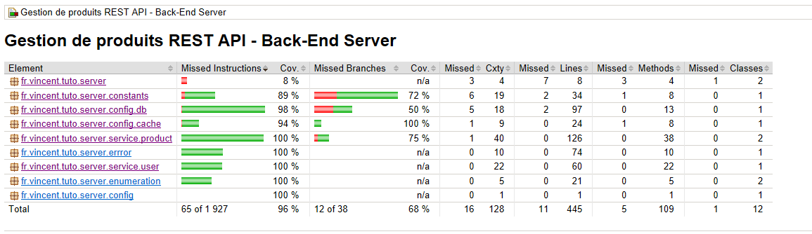

# Secure Web REST API (Products Management)    

# A Propos
`My Products` est une application Web sécurisée de gestion de produits avec leur catégorie (`service Web RESTFul Sécurisé`) écrit en **Java** et embarque **Spring** 
avec d'autres technologies non seulement pour faciliter l'intégration des différents composants applicatifs (traduire en lignes de codes l'expression des besoins) 
mais également sécuriser les échanges avec le SI (sécuriser les ressources de l'application).
Il comporte principalement deux modules :
- un **Back-End Java** , basée sur une architecture `REST` et embarquant :
	- _les exigences fonctionnelles ou métier_, 
	- _les exigences non fonctionnelles_. 
- un **Front-End Angular** (`Client Web`) fournissant les interfaces utilisateur pour faciliter la consommation des fonctionnalités exposées par le Back-End.

**NB** :
- _Les données/informations sont stockées dans une base de données relationnelles_.
- Voir la section `Exigences` pour plus de détails sur les fonctionnalités embarquées.
- Voir la section `Stack Technique` pour plus de détails sur l'ensemble des technos utilisées dans cette application.
- **SI** : **S**ystème d'**I**nformations.	

	
# Spécifications 
Dans cette section, quelques éléments sont fournis pour faciliter la compréhension du besoin et les réalisations techniques à venir.
Les élements des processus de gestion : `autorisation, authentication et sécurisation des ressources` (de l'application), seront mis en place à partir des spécifications
**JWT** avec **Spring Security**. 
Les échanges se feront principalement entre le client (`front-end`) et le serveur (`back-end Java`). Les éléments ci-dessous sont fournis dans le cadre cette spécification :
- Une brève présentation de `JWT` 
- Le diagramme d'architecture applicative et technique
- Les diagrammes de séquences du fonctionnement global des points suivants :
	- Ajouter un nouvel utilisateur avec ses rôles dans le système d'information,
	- Gérer la production/fourniture de jetons d'accès lorsque les utilisateurs se connectent à l'application,	
	- Accès aux resources (_protégées_) de l'application : _fournir le jeton d'accès dans l'en-tête de la requête lors de la demande d'informations_.
- Les schéma et modèle de données pour la gestion des informations **métier** de l'application.

## Brève Présentation JWT  
`JWT` (**J**SON **W**eb **T**oken), est une spécification pour la représentation des revendications (_claims_) à transférer entre deux parties. Les revendications sont codées en tant qu'objet `JSON` utilisé comme charge
 utile d'une structure chiffrée, permettant aux revendications d'être signées ou chiffrées numériquement. La structure peut être :
- **J**SON **W**eb **S**ignature (`JWS`) ou 
- **J**SON **W**eb **E**ncryption (`JWE`).

Les `JWT` contiennent les informations nécéssaires pour aider au stockage de la `session utilisateur`, etc. `JWT` peut être aussi choisi comme format pour les jetons d'accès et d'actualisation utilisés dans le protocole `OAuth2`.

## Les Exigences 

### Les exigences fonctionnelles 
Le tableau ci-dessous fournit une liste non exhaustive des exigences fonctionnelles qui seront embarquées par le SI.
|Processus|Fonctionnalités|
|---|---|
|**Gestion des utilisateurs**|_<ul><li>Se Connecter/Déconnecter de l'application</li><li>Ajouter de nouveaux utilisateurs dans le SI avec leurs rôles</li><li>Mettre à jour les informations d'un utilisateur existant</li><li>Supprimer les informations de l'utilisateur du SI</li><li>Rechercher les informations d'un utilisateur dans le SI selon son identifiant</li><li>Obtenir la liste des utilisateurs du système</li></ul>_| 
|**Gestion des produits**|_<ul><li>Ajouter les informations de nouveaux produits dans le SI</li><li>Mettre à jour les informations d'un produit existant dans le SI</li><li>Supprimer les informations d'un produit du SI</li><li>Rechercher les informations d'un produit dans le SI selon son identifiant</li><li>Obtenir la liste des produits du système</li><li>Obtenir la liste filtrée de produits dont le nom `match` avec le `pattern` fourni</li></ul>_|
|**Gestion des catégories de produits**|_<ul><li>Ajouter de nouvelles catégories de produits dans le SI</li><li>Mettre à jour les informations d'une catégorie de produits dans le SI</li><li>Supprimer les informations d'une catégorie de produits du SI</li><li>Rechercher les informations d'une catégorie de produits dans le SI</li><li>Obtenir la liste des catégories de produits du SI</li><li>Obtenir la liste filtrée de catégories de produits dont le nom de produit `match` avec le `pattern` fourni</li></ul>_|
|**Gestion de la Sécurité**|_<ul><li>Gérer l'Authentification : permet de confirmer ou valider l'identité du client/l’utilisateur qui tente d’accéder au système d'informations</li><li>Gérer l'Autorisation (protection des ressources) : permet d’octroyer au client/l’utilisateur l’accès au système d’informations, donc aux ressources de l'application</li></ul>_|

### Les exigences non fonctionnelles 
Le tableau ci-dessous dresse une liste non exhaustive des exigences non fonctionnelles de l'application.
|Type Exigence|Fonctionnalités|
|---|---|
|**Exigences non fonctionnelles**|_<ul><li>Gérer les logs</li><li>Gérer les erreurs/exceptions</li><li>Gérer les accès à la base de données</li><li>Gérer la migration des scripts de base de données (création de schémas, insertion, mise à jour de tables ou de données ...) avec **Flyway**</li></ul>_|

### Le Client (Front-end)
A la lumière de tout ce qui est présenté ci-dessus, l'interface utilisateur doit permettre selon ses rôles dans l'application (les droits de l'utilisateurs) :
- **Gestion des utilisateurs** :
	- _Se Connecter/Déconnecter de l'application_,
	- _Ajouter/Inscrire un nouvel utilisateur dans le SI_,
	- _Visualiser les informations des utilisateurs_, 
	- _Modifier les informations d'un utilisateur_,
	- Supprimer les informations d'un utilisateur.
- **Gestion des catégories de produits** :
	- _Ajouter les informations d'une nouvelle catégorie de produits_,
	- _Ajouter les informations d'un produit à une catégorie de produits_,
	- _Mettre à jour les informations d'une catégorie de produits_,
	- _Réchercher les informations d'une catégorie de produits (soit par son identifiant, par son nom, ...)_,
	- _Supprimmer du SI les informations d'une catégorie de produits_.	
- **Gestion des produits** :
	- _Ajouter les informations d'un nouveau produit dans le SI_,
	- _Mettre à jour les informations d'un produit existant dans le SI_,
	- _Réchercher les informations d'un produit (soit par son identifiant, par son nom, ...)_,
	- _Supprimer du SI les inforamtions d'un produit_.

## Architecture Applicative et Technique Globale 
Le diagramme ci-dessous fournit une vision globale des flux d'échanges entre l'application et les acteurs du système et(ou) briques/composants applicatifs.
L'architecture applicative et technique comporte les éléments suivants :
- le `Back-End` qui embarque les différents composants permettant d'implémenter toute la logique métier de l'application
- le `Front-End` : interface utlisateur avec les différents composants permettant d'effectuer/faciliter les échanges avec le back-end Java.
- le `SGBDR` : pour le stockage et la persistance des informations métiers de l'application.

## Fonctionnement global - Les USe Case
Le fonctionnement global de l'application est fourni par des vues macroscopiques aux travers de `diagrammes de séquences` des cas d'utilisation (`use case`) présenté dans le tableau ci-dessous :

|Use Case|Description succincte |
|---|---|
|`Ajouter un nouvel utilisateur`|_permet de persister/sauvegarder les informations d'un nouvel utilisateur dans le système d'informations_|
|`S'Authentifier` (_Se Connecter à l'application_)|_permet au client (utilisateur) de fournir les informations pour_ `authentification par le système d'informations`|
|`Accéder aux ressources de l'application`|_Il est composé principalement de deux phases : <ul><li>La demande et obtention des jetons d'accès (phase d'authentification : voir use case du dessus)</li><li>L'accès proprement dit aux ressources de l'application (produits, outils, services,... ) avec le jeton d'accès obtenu de la phase d'authentification</li></ul>_|

### Ajouter un nouvel utilisateur dans le SI
L'ajout ou la persistance des informations d'un nouvel utilisateur dans le système d'informations est présenté par le diagramme de séquences ci-dessous :

### S'Authentifier
Le fonctionnement global de la phase d'authentification du client (valider/confirmer les informations d'identification) par le système d'informations est présenté par le diagramme de séquences ci-dessous fourni.

### Accéder aux ressources de l'application
Ce cas d'utlisation comporte principalement les deux phases suivantes :
- La demande et obtention des jetons d'accès (phase d'authentification : voir use case du dessus)
- L'accès proprement dit aux ressources de l'application (produits, outils, services,... ) avec le jeton d'accès obtenu de la phase d'authentification.

Son fonctionnement global est fourni par le diagramme de séquences ci-dessous : 

## Modèles et Schémas de données
Les modèles fournis sont relatifs au *_*métier_**. Le diagramme de classes ci-dessous présente les relations entre les entités de gestion de la partie métier de l'application.

# Stack Technique
Une liste non exhaustive des technos utilsées pour le développment de cette application :

- C'est un projet `Maven` avec `Spring Boot` donc basé sur le langage `Java` : 
- `PlantUML` avec intégration de `StarUML` pour la production au format markdown des éléments de modélisation et conception des spécifications techniques fournies.
- `Java 11` est utilisé pour la compilation et cible pour l'environnement d'exécution. Le code source est en partie en `Java 8`.
- `Spring Security`, `JWT`, pour sécuriser les échanges (production de jetons, authentification et autorisation).
- `AOP` pour la séparation des préoccupations transversales dans l'application. Ici, il s'agit de la journalisation dans le couches applicatives : `le logging`
- `JPA / Hibernate` pour les concepts ORM et DAO.
- `H2`, `MariaDB`, `PostgreSQL` configurations pour les accès aux données en base et pour la réalisation de TI (`_Tests d'Intégration_` : système)
- `Flyway` pour la migration de bases de données.
- `EhCache` pour optimiser les accès aux données.
- `Angular` pour le développment de l'interface utilisateur (le Clent Web).
- `Docker` pour la containerisation.
- `Lombok` pour générer du code couramment utilisé et faciliter le maintien du code source propre, simplifier l'écriture des classes.
- `Keytool/OpenSSL` pour la génération du magasin des `clés privées/publiques RSA`, export de la clé publique et du certificat dans des fichiers pour exploitation autraversde l'API Java dédiée. 
- `Swagger 3.0.0 /OpenAPI` pour la documentation et tests de l'API.
- `JUnit 5` pour l'écriture des codes sources des classes unitaires et d'intégration.
- `SonarLint` intégré dans l'IDE (_STS_) pour `analyser la qualité du code` livré, poussé dans le `repository` (_bonnes pratiques de développement_).
- `MoreUnit` intégré dans l'IDE (_STS_) pour `taguer` les classes du code source couvertes par des TU (_Tests Unitaires_).
- `JaCoCo` librairie java d'analyse de couverture de codes. Produire/fournir les rapports de couverture du code source (lignes, branches,..) par les tests réalisés. Offrir une visualisation graphique de la couverture
de codes et fournit des rapports détaillés de l'analyse de la couverture.

# Configurations
Les configurations de l'application permettent de faciliter aussi bien le démarrage et exécution que l'exploitation de celle-ci.

## Génération du `jeton JWT`
Afin de rehausser le niveau de sécurité dans l'application, au lieu d'utiliser le **secret HMAC partagé** pour signer le `jeton JWT`, celui-ci sera signer avec des **clés privées/publiques RSA**.
Ceci offre l'avantage que le jeton JWT soit généré et signé par une autorité centrale (généralement un serveur d'autorisation). Ainsi, l'application (les services) 
peut (peuvent) valider le `jeton JWT à l'aide de la clé publique exposée à partir du serveur d'autorisation`.
La mise en place de cette peut donc être effectuer de deux façons différentes :
- **en ligne de commande** : puis exploiter l'API Java pour obtenir les éléméents attendus. 
	- **_commandes Keytool et OpenSSL_** : 
		- Génération du magasin `clés privées/publiques RSA`
		- Export de la clé publique et du certificat dans un fichier
		- Export au format PKCS12
	- **_commandes de OpenSSL_** : puis exploiter l'API Java pour obtenir les éléméents attendus.
		- Génération la `clé privée RSA` 
		- Extraction la clé publique de la paire de clés, qui peut être utilisée dans un certificat
- **avec l'outil graphique** : `KeyStore Explorer`

Les détails sur la mise en place et exploitation de ces éléments sont fournis dans le fichier :
[README](/jwt-auth-web-api-back-end/README.md).

## Base de données 
TODO

## Configuration applicatives 
TODO

# Points de terminaison REST
L'application fournit des points de terminaison HTTP et des outils pour exposer les fonctionnalités proposées.
TODO

# Compilation, Packaging, Exécution et Documentation
## Compilation et Packaging
TODO

## Exécution
TODO

## Documentation Swagger des REST API
TODO

# Les Tests
Les outils de tests classiques de **Java** et **Spring** sont utilisés pour effectuer des tests.

## Les Types de Tests
- **Tests unitaires** : pas seulement pour un effet de test immédiat du code, mais également permettre d'effectuer des tests de non-régression lors de modifications qui interviendront inévitablement durant la vie de l'application.
- **Tests d'intégration** : assurer que le comportement de l'application est toujours aussi conforme, au fur et à mesure de l'assemblage des unités de code. Nous couvirons les deux types à savoir :
	- **_Tests d'intégration composants_** : vérifier que les unités de code fonctionnent corectement ensemble, dans un environnement de test assez proche du test unitaire, c'est-à-dire de manière isolée,
sans lien avec des composants extérieurs et ne permettant pas le démarrage d'une vraie application. Ce type de test répond à la question : `Est-ce que les classes testées unitairement fonctionnent vraiment bien ensemble ?`
	- **_Tests d'intégration système_** : vérifier le bon fonctionnement de plusieurs unités de code au sein d'une configuration d'application, avec éventuellement des liens avec des composants extérieurs
comme une base de données, des fichiers, ou des API en réseau. Ce type de test répond à la question : `Comment pouvons-nous rapidement tester que notre application en fonctionnement collaborerait avec le monde extérieur ?`
- **Tests fonctionnels** :  partent de l'interface utilisateur pour obtenir un résultat selon un scénario prédéfini. Ils imitent l'utilisateur final de l'application. Un démarrage complet de l'application est donc nécessaire.
Ce type de test répond à la question : `Comment pouvons-nous vérifier qu'un utilisateur final utilisera une application conforme et cohérente de bout en bout ?`

## Les Outils de Tests
La partie `test` de l’écosystème `Spring` (Framework de base de l’application) plus précisément sa composante : `spring-boot-starter-test`, avec ses apports : `spring-test, spring-boot-test, spring-boot-test-autoconfigure`, 
fournit des outils permettant la réalisation des types de tests cités ci-dessus.
Le tableau ci-dessous dresse une liste des outils disponibles pour la réalisation des Tests :

|Outil|Description|
|---|---|
|`Mockito/BDDMockito`|_pour les mocks /Style d'écriture des tests de développement (Behavior Driven Development)  piloté par le comportement, il utilise : //given //when //then_|
|`JUnit 5`|_pour l'écriture des classes des Tests Unitaires et d'intégration_|
|`Assert-J`|_pour les assertions_|
|`Postman`|_pour tester les fonctionnalités exposées par les API_|
|`JaCoCo`|_Plugin maven (avec les plugin surefire et failsafe) pour produire/fournir les rapports de couverture de codes_|
|`Swagger`|_Pour générer la documentation et Tester les REST API_|

Les outils de tests proposés ou utilisées sont les suivants :
- Outils de Tests de Spring Framework (spring-boot-starter-test) qui intègre:
	- `spring-test`, `spring-boot-test`, `spring-boot-test-autoconfigure`.
	- `JUnit 5` pour l'écriture des classes des Tests Unitaires et d'intégration.
	- `Mockito` pour les mocks.
	- Assertions avec `Assert-J`,…
- `Swagger`, `Postman` pour tester les fonctionnalités exposées par l'API.
- Plugin `JaCoCo` maven (avec les plugin surefire et failsafe) pour produire le rapport de couverture de code.

## Rapport de couverture de codes
La couverture des tests est mesurée et fournie par `JaCoCo`. L'image ci-dessous fournit la couverture du code de l'application à l'exception des objets de couche de modèle (objets métiers).

La copie d'écran ci-dessous fournit l'image de la couverture des tests lors des 1ères phases de développement du back-end.

# Packaging et Livrables
TODO